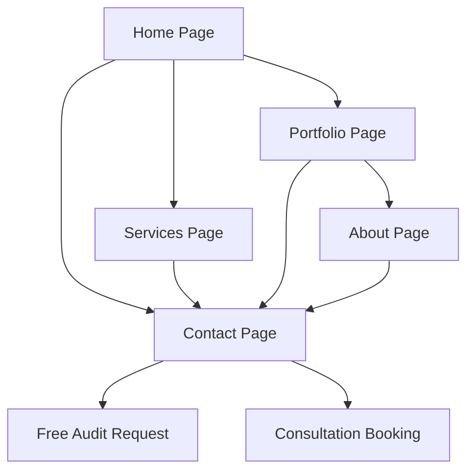

# Modern Web Solutions - Product Requirements Document

## 1. Product Overview
A professional service website specializing in React-based website revamps for local businesses, helping them modernize their digital presence and increase conversions.

The platform showcases expertise in transforming outdated business websites into high-performance, mobile-first experiences that drive customer engagement and business growth. Target market includes local businesses with legacy websites seeking modern, conversion-optimized digital solutions.

## 2. Core Features

### 2.1 User Roles
Since this is a service showcase website, role distinction is not necessary. All visitors have access to view services, portfolio examples, and contact information.

### 2.2 Feature Module
Our Modern Web Solutions website consists of the following main pages:
1. **Home page**: hero section, service overview, value propositions, performance statistics, call-to-action.
2. **Services page**: detailed service offerings, process breakdown, pricing information, payment options.
3. **Portfolio page**: before/after showcases, demo examples, case studies, client testimonials.
4. **About page**: company mission, team expertise, React specialization, why choose us.
5. **Contact page**: contact form, free audit request, consultation booking, contact information.

### 2.3 Page Details

| Page Name | Module Name | Feature description |
|-----------|-------------|---------------------|
| Home page | Hero section | Display compelling headline, value proposition, and primary call-to-action button |
| Home page | Statistics showcase | Present key performance metrics (20% conversion impact, 70% mobile usage, 2% revenue increase) |
| Home page | Service preview | Highlight core services with brief descriptions and links to detailed pages |
| Home page | Social proof | Display client success stories and conversion improvements |
| Services page | Service catalog | List complete website redesigns, performance audits, modern integrations, ongoing support |
| Services page | Process breakdown | Explain step-by-step approach from audit to delivery |
| Services page | Payment options | Display accepted payment methods (Solana, USDC, PayPal, invoicing) |
| Services page | Pricing transparency | Show clear pricing structure without hidden fees |
| Portfolio page | Before/after gallery | Showcase website transformation examples with performance improvements |
| Portfolio page | Demo showcase | Interactive examples of modern features and mobile navigation |
| Portfolio page | Case studies | Detailed client success stories with measurable results |
| Portfolio page | Technology highlights | Demonstrate React capabilities and modern web practices |
| About page | Company mission | Explain focus on local business growth and digital transformation |
| About page | Expertise showcase | Highlight React specialization and modern web development skills |
| About page | Value proposition | Detail why React and modern practices matter for business success |
| Contact page | Contact form | Capture client inquiries with service interest and project details |
| Contact page | Free audit request | Dedicated form for complimentary website analysis |
| Contact page | Consultation booking | Schedule demo presentations and proposal meetings |
| Contact page | Contact information | Display business contact details and response timeframes |

## 3. Core Process

The main user flow focuses on converting visitors into clients through education and demonstration:

1. **Discovery Flow**: Visitor lands on homepage → learns about React benefits → views service details → sees portfolio examples
2. **Conversion Flow**: Interested visitor → requests free audit → schedules consultation → receives proposal → becomes client
3. **Engagement Flow**: Visitor explores portfolio → views case studies → understands value proposition → contacts for services

## 4. User Interface Design

### 4.1 Design Style
- **Primary colors**: Modern blue (#2563eb) and clean white (#ffffff)
- **Secondary colors**: Accent orange (#f97316) for call-to-action elements
- **Button style**: Rounded corners with subtle shadows and hover animations
- **Font**: Clean sans-serif (Inter or similar) with 16px base size, 24px headings
- **Layout style**: Card-based design with generous white space and top navigation
- **Icons**: Modern outline-style icons with consistent stroke width

### 4.2 Page Design Overview

| Page Name | Module Name | UI Elements |
|-----------|-------------|-------------|
| Home page | Hero section | Large background image, bold headline text, prominent CTA button with gradient background |
| Home page | Statistics showcase | Card layout with large numbers, icons, and brief explanations in grid format |
| Services page | Service catalog | Icon-based service cards with hover effects and "Learn More" buttons |
| Services page | Payment options | Clean icons for each payment method with brief descriptions |
| Portfolio page | Before/after gallery | Split-screen comparison images with smooth transitions and overlay details |
| Portfolio page | Demo showcase | Interactive elements with subtle animations and mobile-responsive previews |
| About page | Expertise showcase | Timeline or grid layout highlighting React skills and modern web practices |
| Contact page | Contact form | Clean form design with validation states and progress indicators |
| Contact page | Free audit request | Prominent form with contrasting background and compelling copy |

### 4.3 Responsiveness
The website is mobile-first and fully responsive, optimized for touch interactions on tablets and smartphones. Desktop experience enhances the mobile design with larger layouts and additional interactive elements.