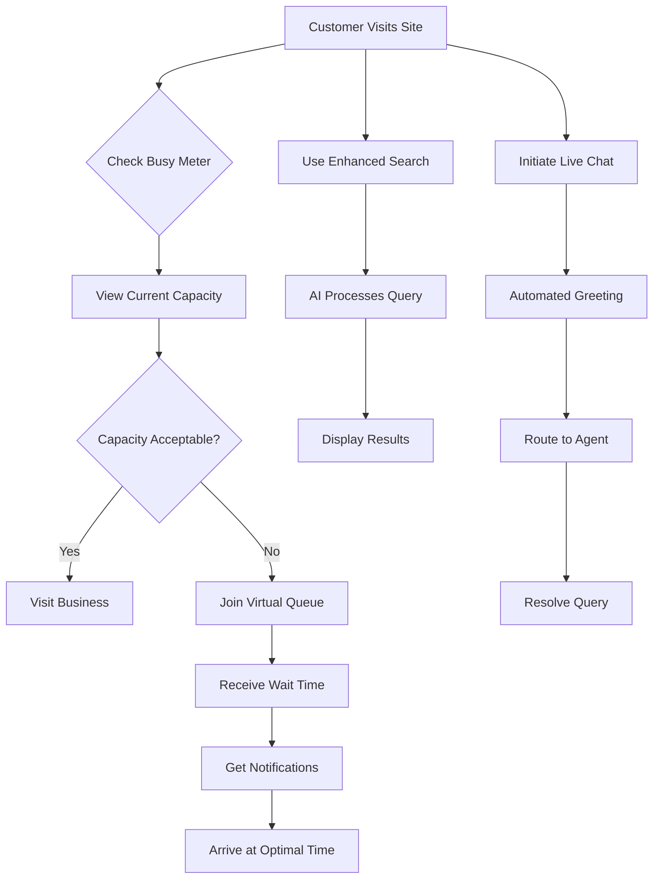

# WAGUS Services Premium Add-Ons - Product Requirements Document

## 1. Product Overview

A comprehensive suite of premium add-on features that enhance core web development projects with advanced functionality including real-time busy monitoring, intelligent queue management, enhanced search capabilities, and 24/7 live chat support.

These add-ons address specific business needs for high-traffic establishments, service-based businesses, and e-commerce platforms by providing data-driven insights and improved customer experience tools. Each add-on can be purchased individually or as part of premium packages, creating additional revenue streams while delivering exceptional value to clients.

## 2. Core Features

### 2.1 User Roles

| Role           | Registration Method       | Core Permissions                                                  |
| -------------- | ------------------------- | ----------------------------------------------------------------- |
| Business Owner | Admin dashboard access    | Full control over all add-on features, analytics, and settings    |
| Staff Member   | Invited by business owner | Monitor queues, respond to chats, view busy metrics               |
| Customer       | Public access             | View busy meters, join queues, use enhanced search, initiate chat |
| WAGUS Admin    | Internal access           | Configure add-ons, monitor performance, provide support           |

### 2.2 Feature Module

Our premium add-ons consist of the following main components:

1. **Busy Meter Dashboard**: real-time occupancy tracking, historical analytics, capacity management, peak time predictions.
2. **Queue Management System**: virtual queue creation, wait time estimation, notification system, queue analytics.
3. **Enhanced Search Engine**: AI-powered search, advanced filtering, semantic search, search analytics.
4. **Live Chat Platform**: 24/7 chat support, automated responses, chat routing, conversation analytics.
5. **Add-On Configuration**: feature toggles, pricing management, integration settings, performance monitoring.

### 2.3 Page Details

| Page Name            | Module Name            | Feature description                                                                                      |
| -------------------- | ---------------------- | -------------------------------------------------------------------------------------------------------- |
| Busy Meter Dashboard | Real-Time Monitoring   | Display current occupancy levels with color-coded indicators, live capacity percentage, and trend graphs |
| Busy Meter Dashboard | Historical Analytics   | Show peak hours analysis, weekly/monthly patterns, capacity utilization reports, and predictive insights |
| Busy Meter Dashboard | Capacity Management    | Set maximum capacity limits, configure busy thresholds, manage multiple locations, and alert settings    |
| Queue Management     | Virtual Queue Creation | Allow customers to join queues remotely, assign queue numbers, set estimated wait times                  |
| Queue Management     | Wait Time Estimation   | Calculate dynamic wait times based on service patterns, notify customers of delays, optimize queue flow  |
| Queue Management     | Notification System    | Send SMS/email updates, push notifications for queue status, automated check-in reminders                |
| Enhanced Search      | AI-Powered Search      | Implement intelligent search with natural language processing, auto-suggestions, and typo tolerance      |
| Enhanced Search      | Advanced Filtering     | Provide multi-criteria filtering, faceted search, price ranges, location-based results                   |
| Enhanced Search      | Search Analytics       | Track search queries, popular terms, conversion rates, and search performance metrics                    |
| Live Chat Platform   | 24/7 Chat Support      | Provide round-the-clock customer support with human agents and AI assistance                             |
| Live Chat Platform   | Automated Responses    | Deploy chatbots for common queries, instant FAQ responses, and intelligent routing                       |
| Live Chat Platform   | Chat Analytics         | Monitor response times, customer satisfaction, chat volume, and agent performance                        |
| Add-On Configuration | Feature Management     | Enable/disable specific add-ons, configure pricing tiers, manage user permissions                        |
| Add-On Configuration | Integration Settings   | Connect with existing systems, API configurations, third-party service integrations                      |

## 3. Core Process

**Busy Meter Flow**: Customer checks busy status → views real-time occupancy → decides optimal visit time → business tracks patterns → optimizes operations

**Queue Management Flow**: Customer joins virtual queue → receives position and wait time → gets notifications → arrives at optimal time → completes service

**Enhanced Search Flow**: Customer enters search query → AI processes and suggests → filters applied → relevant results displayed → analytics tracked

**Live Chat Flow**: Customer initiates chat → automated greeting → routed to appropriate agent → conversation handled → feedback collected

**Admin Management Flow**: Business owner configures add-ons → monitors performance → adjusts settings → reviews analytics → optimizes features

## 4. User Interface Design

### 4.1 Design Style

* **Primary colors**: Professional blue (#2563eb) with status indicators - green (#10b981) for available, amber (#f59e0b) for moderate, red (#ef4444) for busy

* **Secondary colors**: Clean whites and grays for backgrounds, accent colors for notifications and alerts

* **Button style**: Modern rounded buttons with hover effects, prominent CTAs for queue joining and chat initiation

* **Font**: Inter font family, 16px base, 24px for dashboard headings, 14px for data displays

* **Layout style**: Card-based dashboards with real-time updating widgets, responsive grid layouts

* **Icons**: Status indicators (traffic light system), queue icons, search magnifiers, chat bubbles

### 4.2 Page Design Overview

| Page Name            | Module Name          | UI Elements                                                                                               |
| -------------------- | -------------------- | --------------------------------------------------------------------------------------------------------- |
| Busy Meter Dashboard | Real-Time Monitoring | Large circular progress indicators, color-coded status bars, live updating numbers with smooth animations |
| Queue Management     | Virtual Queue        | Queue position display with estimated time, progress bars, notification bell icons                        |
| Enhanced Search      | Search Interface     | Prominent search bar with auto-complete dropdown, filter sidebar, result cards with rich snippets         |
| Live Chat Platform   | Chat Interface       | Floating chat widget, conversation bubbles, typing indicators, emoji support                              |
| Add-On Configuration | Admin Panel          | Toggle switches for features, pricing sliders, integration status indicators, performance charts          |

### 4.3 Responsiveness

All add-ons are mobile-first responsive with touch-optimized interfaces. Busy meters display prominently on mobile, queue management works seamlessly on smartphones, enhanced search adapts to screen sizes, and live chat provides optimal mobile experience.

## 5. Add-On Pricing Structure

### 5.1 Individual Add-On Pricing

* **Busy Meter**: $99/month - Real-time capacity monitoring with basic analytics

* **Queue Management**: $149/month - Virtual queue system with notifications

* **Enhanced Search**: $199/month - AI-powered search with advanced filtering

* **Live Chat 24/7**: $299/month - Round-the-clock chat support with automation

### 5.2 Bundle Packages

* **Business Essentials** (Busy Meter + Queue): $199/month (20% savings)

* **Customer Experience** (Search + Chat): $399/month (20% savings)

* **Complete Suite** (All 4 add-ons): $599/month (33% savings)

### 5.3 Implementation Fees

* Setup and integration: $500-$1,500 per add-on (depending on complexity)

* Custom configurations: $200/hour

* Training and onboarding: $300 per session

* Priority support: $99/month additional

## 6. Technical Requirements

### 6.1 Busy Meter Technology

* Real-time data processing with WebSocket connections

* Integration with POS systems, door counters, or manual input

* Cloud-based analytics with 99.9% uptime guarantee

* Mobile app for staff to update capacity manually

### 6.2 Queue Management Infrastructure

* SMS/email notification system integration

* QR code generation for easy queue joining

* Integration with existing booking systems

* Real-time queue position updates

### 6.3 Enhanced Search Implementation

* Elasticsearch or similar search engine backend

* Machine learning for search result optimization

* A/B testing framework for search improvements

* Analytics dashboard for search performance

### 6.4 Live Chat Platform

* Multi-channel support (web, mobile, social media)

* CRM integration for customer history

* AI chatbot with natural language processing

* Agent dashboard with conversation management

## 7. Success Metrics

### 7.1 Busy Meter KPIs

* Reduction in customer wait times by 30%

* Increase in customer satisfaction scores by 25%

* Optimization of staff scheduling efficiency

* 15% increase in peak hour revenue

### 7.2 Queue Management KPIs

* 50% reduction in physical waiting

* 90% customer notification delivery rate

* 40% improvement in service flow efficiency

* 20% increase in customer retention

### 7.3 Enhanced Search KPIs

* 60% improvement in search result relevance

* 35% increase in search-to-conversion rate

* 25% reduction in search abandonment

* 45% increase in average session duration

### 7.4 Live Chat KPIs

* 24/7 availability with <2 minute response time

* 95% customer satisfaction rating

* 70% first-contact resolution rate

* 30% increase in lead conversion from chat

