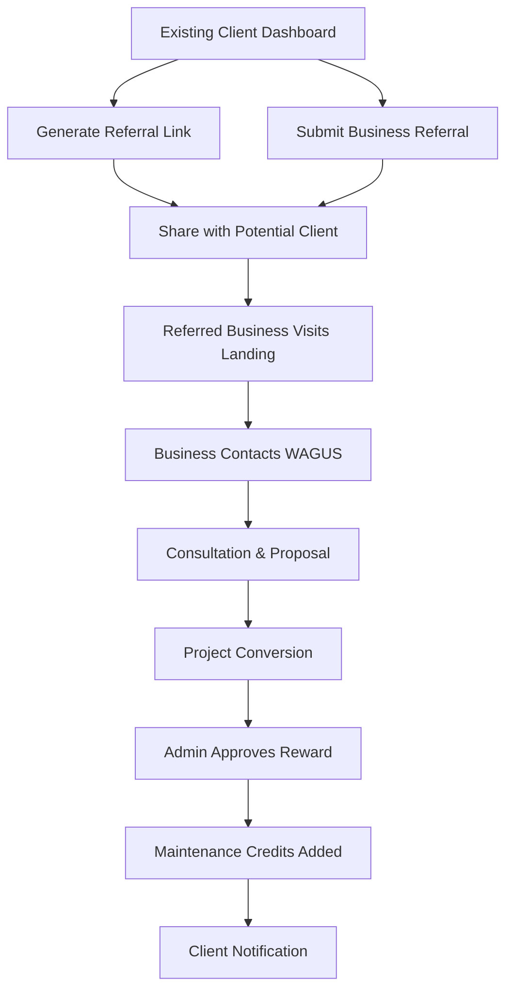

# WAGUS Services Referral System - Product Requirements Document

## 1. Product Overview

A comprehensive referral system that incentivizes existing WAGUS Services clients to refer new businesses, creating a sustainable customer acquisition channel while rewarding loyal clients with free maintenance months.

The system addresses the challenge of acquiring new clients in the competitive web development market by leveraging satisfied customers as brand ambassadors. Existing clients who refer successful new business will receive escalating maintenance benefits, creating a win-win ecosystem that drives organic growth.

## 2. Core Features

### 2.1 User Roles

| Role              | Registration Method                           | Core Permissions                                            |
| ----------------- | --------------------------------------------- | ----------------------------------------------------------- |
| Existing Client   | Automatic enrollment after project completion | Can generate referral links, track referrals, view rewards  |
| Referred Business | Standard contact form with referral code      | Can be tracked as referral, receives standard service       |
| Admin             | Internal access                               | Manage referral tracking, approve rewards, generate reports |

### 2.2 Feature Module

Our referral system consists of the following main pages:

1. **Referral Dashboard**: personal referral statistics, reward tracking, referral link generation, maintenance balance display.
2. **Referral Submission**: referral form for existing clients, business contact capture, referral tracking initiation.
3. **Reward Management**: maintenance credit tracking, reward history, redemption options, tier progression display.
4. **Admin Panel**: referral oversight, reward approval, analytics dashboard, client management.
5. **Public Referral Landing**: dedicated page for referred businesses, referral validation, service information.

### 2.3 Page Details

| Page Name               | Module Name               | Feature description                                                                                              |
| ----------------------- | ------------------------- | ---------------------------------------------------------------------------------------------------------------- |
| Referral Dashboard      | Statistics Overview       | Display total referrals made, successful conversions, pending referrals, and current maintenance credit balance  |
| Referral Dashboard      | Referral Link Generator   | Create unique tracking links for sharing with potential clients via email, social media, or direct communication |
| Referral Dashboard      | Tier Progress             | Show current referral tier, progress to next level, and associated benefits for each tier                        |
| Referral Submission     | Business Information Form | Capture referred business details including company name, contact person, website URL, and service needs         |
| Referral Submission     | Referral Tracking         | Generate unique referral codes and initiate tracking process for submitted referrals                             |
| Reward Management       | Maintenance Credits       | Display current balance, earned credits, redeemed credits, and expiration dates for maintenance months           |
| Reward Management       | Reward History            | Show chronological list of earned rewards, redemption history, and referral success details                      |
| Reward Management       | Tier Benefits             | Explain current tier benefits, requirements for advancement, and exclusive perks                                 |
| Admin Panel             | Referral Oversight        | View all active referrals, approve successful conversions, manage reward distribution                            |
| Admin Panel             | Analytics Dashboard       | Track referral program performance, conversion rates, top referrers, and ROI metrics                             |
| Public Referral Landing | Referral Validation       | Verify referral codes, display referring client information, and apply referral benefits                         |
| Public Referral Landing | Service Showcase          | Present WAGUS Services offerings with referral-specific messaging and incentives                                 |

## 3. Core Process

**Existing Client Referral Flow**: Client logs into referral dashboard → generates referral link or submits business details → shares with potential client → tracks referral progress → receives maintenance credits upon successful conversion

**Referred Business Flow**: Receives referral link → visits landing page → contacts WAGUS Services → mentions referral during consultation → becomes client → referrer receives reward

**Admin Management Flow**: Monitor incoming referrals → validate business conversions → approve maintenance credit rewards → track program performance

## 4. User Interface Design

### 4.1 Design Style

* **Primary colors**: Consistent with main site - modern blue (#2563eb) and clean white (#ffffff)

* **Secondary colors**: Success green (#10b981) for rewards, warning amber (#f59e0b) for pending status

* **Button style**: Rounded corners with gradient effects for referral CTAs, standard buttons for navigation

* **Font**: Inter font family, 16px base size, 20px for dashboard headings, 14px for data tables

* **Layout style**: Card-based dashboard design with sidebar navigation and progress indicators

* **Icons**: Reward-themed icons (gift, star, trophy) combined with standard outline icons

### 4.2 Page Design Overview

| Page Name               | Module Name               | UI Elements                                                                                         |
| ----------------------- | ------------------------- | --------------------------------------------------------------------------------------------------- |
| Referral Dashboard      | Statistics Overview       | Large number displays with icons, progress bars for tier advancement, color-coded status indicators |
| Referral Dashboard      | Referral Link Generator   | Copy-to-clipboard functionality, social sharing buttons, QR code generation for easy sharing        |
| Referral Submission     | Business Information Form | Multi-step form with validation, auto-complete for business types, file upload for business cards   |
| Reward Management       | Maintenance Credits       | Credit balance prominently displayed, visual timeline for credit usage, expiration warnings         |
| Admin Panel             | Analytics Dashboard       | Charts and graphs for performance metrics, filterable data tables, export functionality             |
| Public Referral Landing | Referral Validation       | Referrer appreciation message, trust badges, seamless transition to main contact flow               |

### 4.3 Responsiveness

The referral system is fully responsive with mobile-first design, optimized for clients to easily share referrals on mobile devices. Dashboard components stack vertically on smaller screens while maintaining full functionality.

## 5. Referral Reward Structure

### 5.1 Maintenance Credit System

* **First Successful Referral**: 1 month free maintenance

* **Second Successful Referral**: 1 additional month (2 months total)

* **Third Successful Referral**: 2 additional months (4 months total)

* **Fourth+ Successful Referrals**: 3 months per referral

### 5.2 Tier Benefits

* **Bronze Tier** (1-2 referrals): Basic maintenance credits, referral tracking

* **Silver Tier** (3-5 referrals): Priority support, extended maintenance credits

* **Gold Tier** (6+ referrals): Exclusive consultation access, bonus maintenance months, early feature access

### 5.3 Credit Management

* Maintenance credits expire 24 months after earning

* Credits can be applied to any WAGUS Services maintenance package

* Unused credits can be transferred to future projects

* Credits are non-transferable between clients

